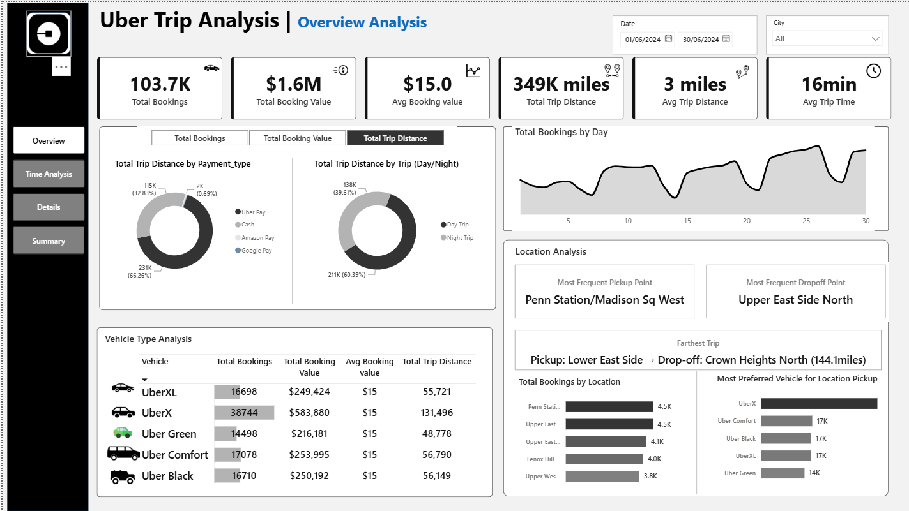
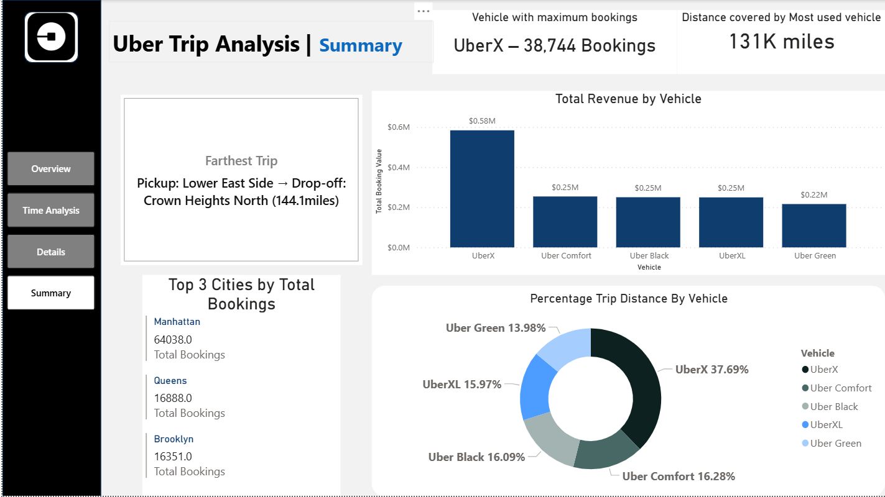
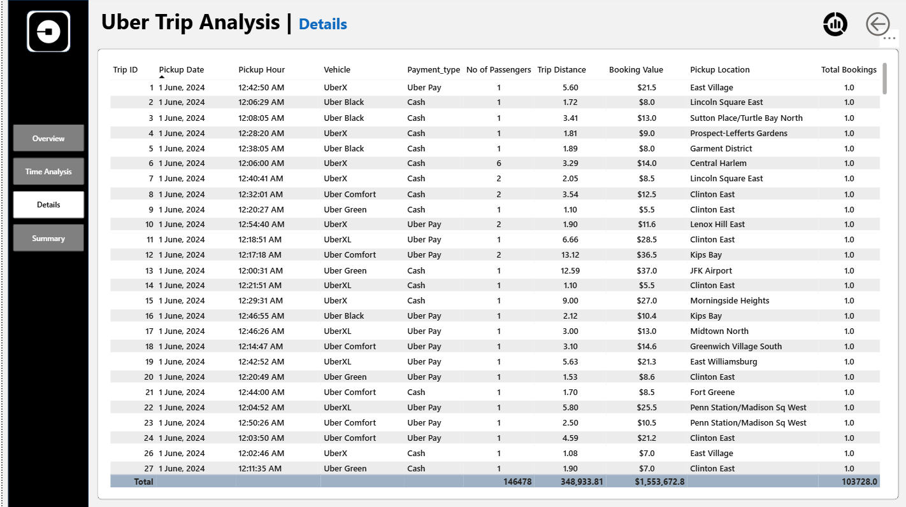

# 🚗 Uber Trip Analysis Dashboard

This project explores Uber trip data to uncover trends in booking patterns, city-wise demand, and customer behavior. It was completed as part of a **group project** during my Business Insights & Analytics program, focusing on collaborative analysis and visualization using Power BI and Excel.

---

## 🔧 Tools & Technologies
- **Power BI** – for interactive dashboards and data visualization  
- **Excel** – for data cleaning, transformation, and initial analysis  

---

## 📌 Key Insights
- Identified the top 3 cities with the highest number of bookings  
- Analyzed peak travel hours and popular trip times  
- Calculated average trip distances and fare ranges  
- Built interactive dashboards with filters for city, time, and trip type  
- Visualized customer demand trends over time  

---

## 📷 Screenshots

### Dashboard Overview

### Time Analysis

### Summary View

### Detail View

---

## 📁 Project Structure
uber-trip-analysis/
├── data/ # Excel datasets used for analysis
├── powerbi/ # Power BI (.pbix) dashboard file
├── screenshots/ # Images of key dashboard visuals
└── README.md # Project overview and documentation
